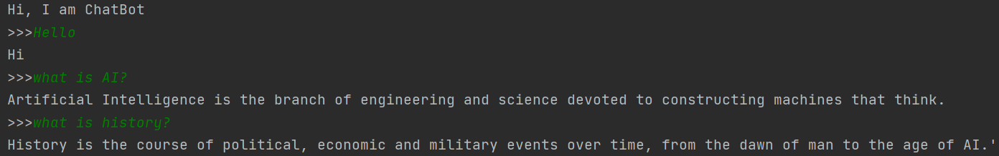

# AI Chatbot — Emotion-Aware Conversational Assistant

A Flask-based AI chatbot that goes beyond simple keyword matching by combining **emotion detection**, **sentiment analysis**, and **semantic understanding** to deliver context-aware responses.

---

## Features

| Capability | Technology |
|---|---|
| Emotion detection | HuggingFace Transformers (`distilRoBERTa`) |
| Sentiment analysis | TextBlob |
| Semantic matching | Sentence-Transformers (`all-MiniLM-L6-v2`) |
| NLP preprocessing | spaCy (`en_core_web_sm`) |
| General knowledge fallback | Wikipedia API |
| Predefined responses | JSON config (English + Arabic) |
| Unmatched query logging | MySQL |
| Unanswered question alerts | Mailgun email notifications |
| Web UI | Flask + jQuery chat widget |

---

## Demo

**Chat Widget (Web UI)**


**Terminal Mode**



---

## How It Works

```
User message
    │
    ├─ Emotion detection    (joy / anger / sadness / fear / surprise)
    ├─ Sentiment scoring    (positive / neutral / negative)
    ├─ Text preprocessing   (lemmatization, stopword removal)
    ├─ Word matching        (bot.json predefined responses)
    ├─ Semantic matching    (cosine similarity > 0.5 threshold)
    ├─ Wikipedia fallback   ("what is X", "who is X", "define X")
    └─ MySQL logging        (stores unanswered questions for review)
           └─ Email alert   (Mailgun notification to support team)
```

---

## Prerequisites

- Python 3.9+
- MySQL server (running locally or remote)
- [Optional] Docker

---

## Quick Start

### 1. Clone the repository

```bash
git clone <your-repo-url>
cd <repo-folder>/Chatbot-for-Biginners
```

### 2. Set up environment variables

```bash
cp .env.example .env
```

Open `.env` and fill in your credentials (see [Environment Variables](#environment-variables) below).

### 3. Set up the database

Start MySQL and create the database and table:

```bash
python daly.py
```

### 4. Install dependencies

```bash
pip install -r chatbot_flask_requirements.txt
```

### 5. Download the spaCy language model

```bash
python -m spacy download en_core_web_sm
```

### 6. Run the app

```bash
python app.py
```

Open your browser at [http://localhost:5000](http://localhost:5000).

---

## Docker (Recommended for Quick Demo)

```bash
cd Chatbot-for-Biginners
docker build -t ai-chatbot .
docker run -p 5000:5000 --env-file .env ai-chatbot
```

Then visit [http://localhost:5000](http://localhost:5000).

---

## Environment Variables

Create a `.env` file from the example template:

```bash
cp Chatbot-for-Biginners/.env.example Chatbot-for-Biginners/.env
```

| Variable | Description |
|---|---|
| `MAILGUN_API_KEY` | Mailgun API key for email notifications |
| `MAILGUN_DOMAIN` | Your Mailgun sandbox or production domain |
| `ALERT_EMAIL` | Email address to receive unanswered question alerts |
| `DB_HOST` | MySQL host (default: `localhost`) |
| `DB_USER` | MySQL username (default: `root`) |
| `DB_PASSWORD` | MySQL password |
| `DB_NAME` | MySQL database name (default: `mightguy`) |

---

## Project Structure

```
Chatbot-for-Biginners/
├── app.py                          # Flask web app (main entry point)
├── ChatBot.py                      # Terminal-based chatbot (standalone)
├── daly.py                         # One-time database setup script
├── bot.json                        # Predefined responses (English + Arabic)
├── Dockerfile                      # Container configuration
├── chatbot_flask_requirements.txt  # Full dependency list
├── requirements.txt                # Minimal dependency list
├── .env.example                    # Environment variable template
├── templates/
│   └── index.html                  # Chat widget UI
└── static/
    ├── chatbot.png                 # Bot avatar
    └── rais5.png                   # Project image
```

---

## API

| Method | Endpoint | Body | Response |
|---|---|---|---|
| `GET` | `/` | — | Renders the chat UI |
| `POST` | `/get` | `{"msg": "hello", "id": "user123"}` | `{"msg": "bot reply"}` |

---

## Tech Stack

- **Backend**: Python 3.9, Flask 2.0
- **AI/NLP**: HuggingFace Transformers, spaCy, Sentence-Transformers, TextBlob, NLTK
- **ML Runtime**: PyTorch
- **Database**: MySQL
- **Frontend**: HTML5, CSS3, jQuery
- **Notifications**: Mailgun
- **Container**: Docker
